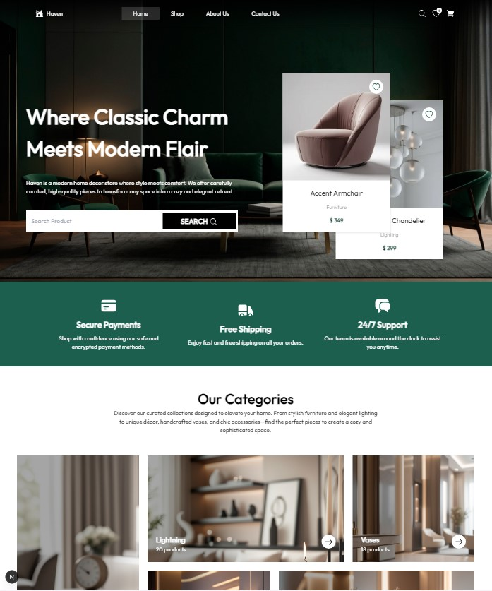
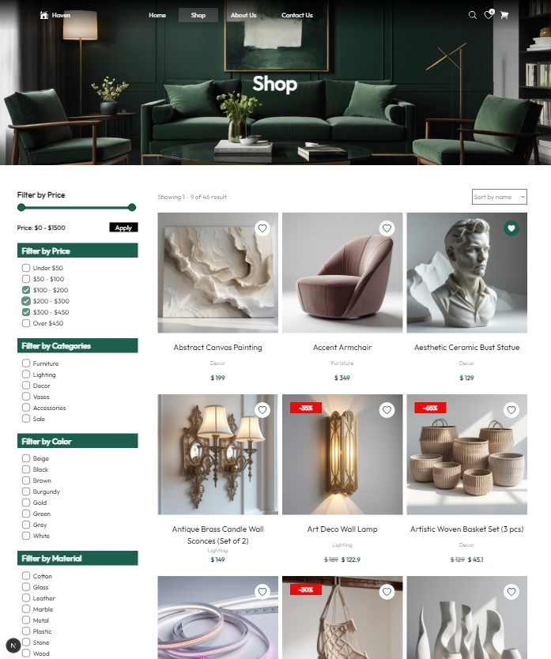
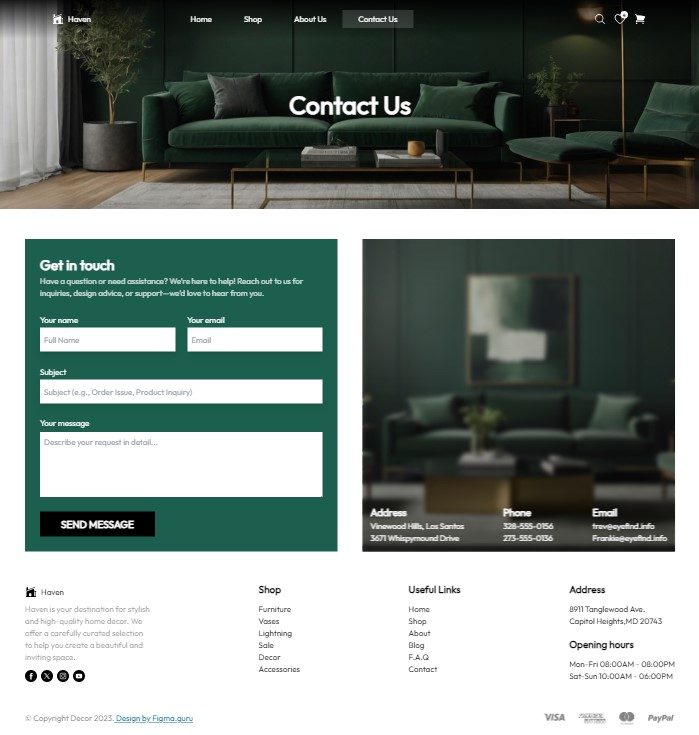

# 🛋️ HavenDecor – Home Decor Online Store

HavenDecor is a modern and elegant interior shop website built using **Next.js**, **Tailwind CSS**, and **Supabase**. It allows users to explore a catalog of home decor items with features like filtering, pagination, and a favorites system (via `localStorage`). It also includes a contact form that stores messages directly to the Supabase database.

> ⚠️ Note: The layout is only partially responsive. It works up to a tablet width of ~1024px. Some design issues may appear on smaller screens.

---

## ✨ Features

- 🏠 Beautiful landing page with curated product displays
- 🛒 Dynamic product catalog powered by Supabase
- 🔍 Filtering and price sorting
- 📦 Pagination for large product lists
- ❤️ Add to Favorites (stored in browser `localStorage`)
- 📨 Contact form (writes to Supabase table)
- 💡 Reusable UI components
- 💻 Built with Next.js App Router

---

## 📷 Screenshots





---

## 🚀 Tech Stack

- **Next.js 13 (App Router)**
- **React**
- **Tailwind CSS**
- **Supabase (as backend database)**
- **localStorage** (for favorites)
- **Custom filtering & pagination logic**

---

## 🧱 Folder Structure

```bash
📂 app
 ├── 📂components
 ├── 📂_lib
 ├── 📂_styles
 ├── 📂about
 ├── 📂constants
 ├── 📂contact
 ├── 📂utils
 └── 📂shop
📂 public 
```

---

## 🛠️ Getting Started

```bash
# Clone the repository
git clone https://github.com/whitepink1/home-decor.git

# Navigate into the project directory
cd home-decor

# Install dependencies
npm install

# Set up environment variables for Supabase
cp .env.example .env.local
# (Fill in your Supabase URL and anon key)

# Run the development server
npm run dev
```

---

## 🔮 Roadmap / Limitations

● ❌ No detailed product page (wasn't included in the design)

● ❌ No authentication system

● 📱 Limited responsiveness (tablet only)

● ✅ Potential to add admin dashboard & auth in the future

---

## 🧑‍🎨 Design Credits

Designed by [Figma Guru](https://www.figma.com/community/file/1367077018040074328/decor-figma-template) (Figma community resource)

---

## 📄 License
This project is for educational and portfolio purposes. Not intended for commercial use.